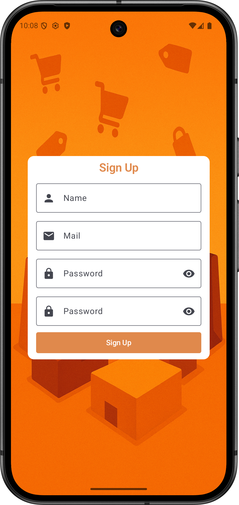
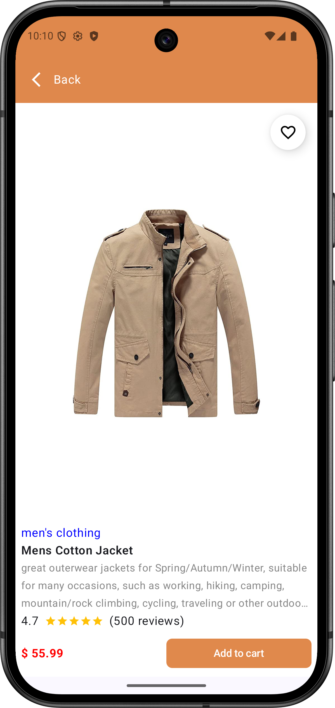
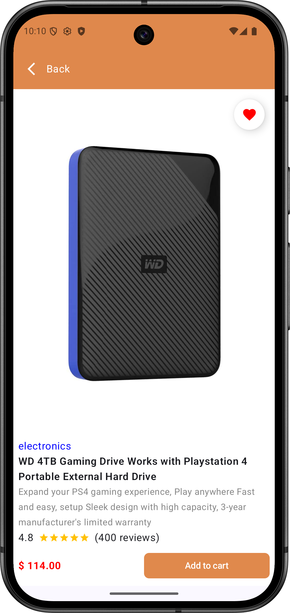
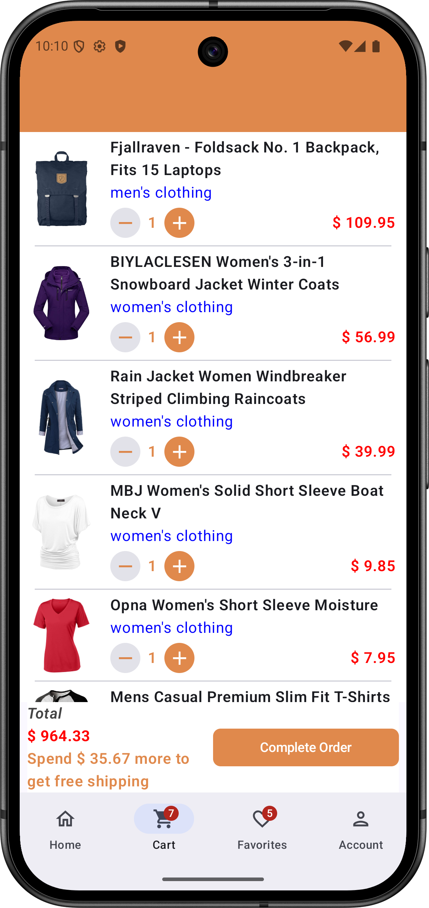
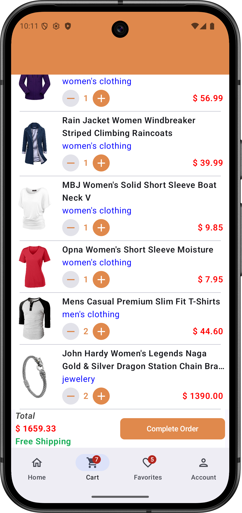
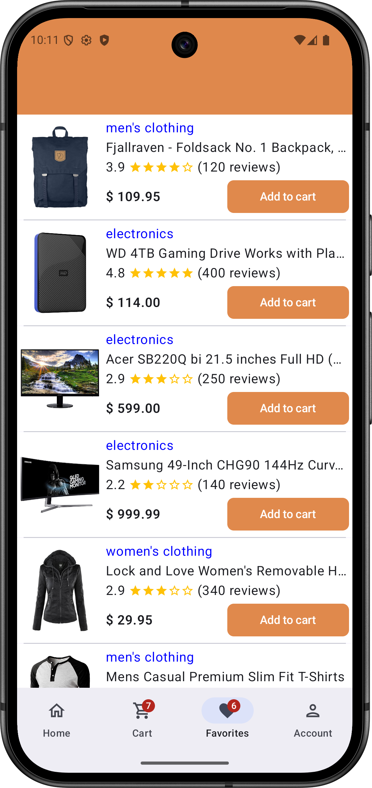
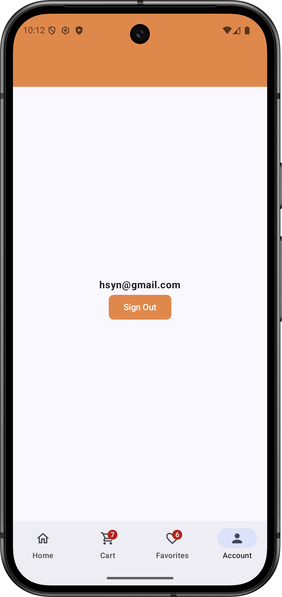

# 🛍️ CheapMall

CheapMall is a modern e-commerce app built with Jetpack Compose, focusing on clean architecture and Firebase integration. It allows users to sign up, sign in, browse products, add items to cart or favorites, and manage them based on their authenticated session — all powered by Firebase Authentication and Firestore.

---

## 🔍 Overview

* **CheapMall** provides a smooth, composable-first shopping experience.
* Authenticated users can add products to their **cart** or **favorites**.
* Cart and favorite items are stored and synced via **Firebase Firestore**, scoped per user.
* The app demonstrates clean Jetpack Compose UI patterns, responsive layouts, and real-time database usage.

---

## 📱 Screenshots

  
  
  

  
  
  

  
  
  

---

## 🧱 Architecture

* Follows the **MVVM** pattern with a **Clean Architecture** approach.
* **Single-Activity** architecture using **Jetpack Navigation Compose** for screen transitions.
* UI logic is managed through **ViewModels** that expose `StateFlow`-based UI states.
* Domain layer defines **repository interfaces** to decouple business logic from data sources.
* Data layer provides **concrete Firebase-based implementations** of these repositories (e.g., Auth, Cart, Favorites).
* All layers are connected using **Dependency Injection via Hilt** for testability and scalability.

---

## 📦 Package Structure

* `core` → App-wide utilities such as constants (Constants) and input validation (InputValidator).
* `data` → Firebase Firestore interaction logic, authentication logic, and repository implementations.
* `di` → Hilt modules for injecting Firebase, repositories and network.
* `domain` → Interfaces for auth and product/cart/favorite repositories.
* `presentation` → Jetpack Compose screens, ViewModels, state management, UI models, utils and navigation.

---

## ⚙️ Tech Stack

* **Kotlin**, **Coroutines**, **StateFlow**
* **Jetpack Compose** – Declarative UI
* **Firebase Authentication** – User sign up, sign in, sign out
* **Firebase Firestore** – Cloud database for per-user cart and favorite storage
* **Hilt** – Dependency Injection
* **Jetpack Navigation Compose** – Screen navigation
* **Material 3** – Declarative Material Design components for Compose

---

## 🚀 Features (Planned & Implemented)

- [x] Splash screen and app intro
- [x] Sign up / Sign in with Firebase
- [x] Product list and detail screen
- [x] Add/remove items from cart and favorites
- [x] Firestore integration scoped to authenticated user
- [ ] Order confirmation and past orders history
- [ ] Account screen redesign and improvements
